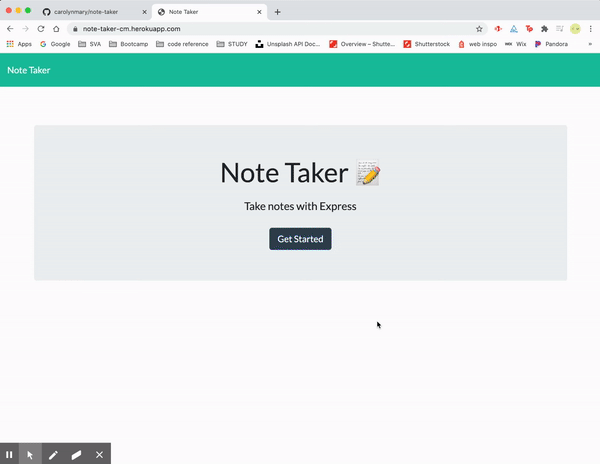

<!-- Badges: MAY NEED TO ADJUST LICENSE BADGE URL -->
  

<!--  -->
# Note Taker
[note-taker-cm.herokuapp.com](https://note-taker-cm.herokuapp.com/)

- - -
- - -
### Use this application to keep track of important information by writing down, editing and saving notes here. 

- - -
- - -

<!-- TOC -->
[How to Use](#how-to-use) // [License](#license) // [Questions & Feedback](#questions-feedback) 

## How to Use 

## License
    
The code is licensed under the [MIT](https://choosealicense.com/licenses/mit/) License.
  
## Questions & Feedback
  
Have a question or feedback? Send me a note or just say hi, I'd be happy to hear from you!
  
Email: carolyn@carolynmary.com  
  
GitHub: [carolynmary](https://github.com/carolynmary)  
  
Porfolio: [carolynmary.com](https://carolynmary.com) 
  
> “Knowledge is having the right answer. Intelligence is asking the right question.” ~ Unknown
  
 

© 2020 Carolyn Mary Stolze